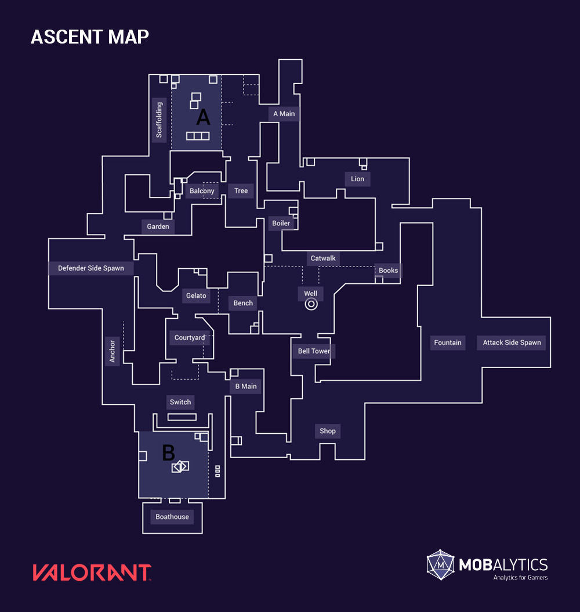
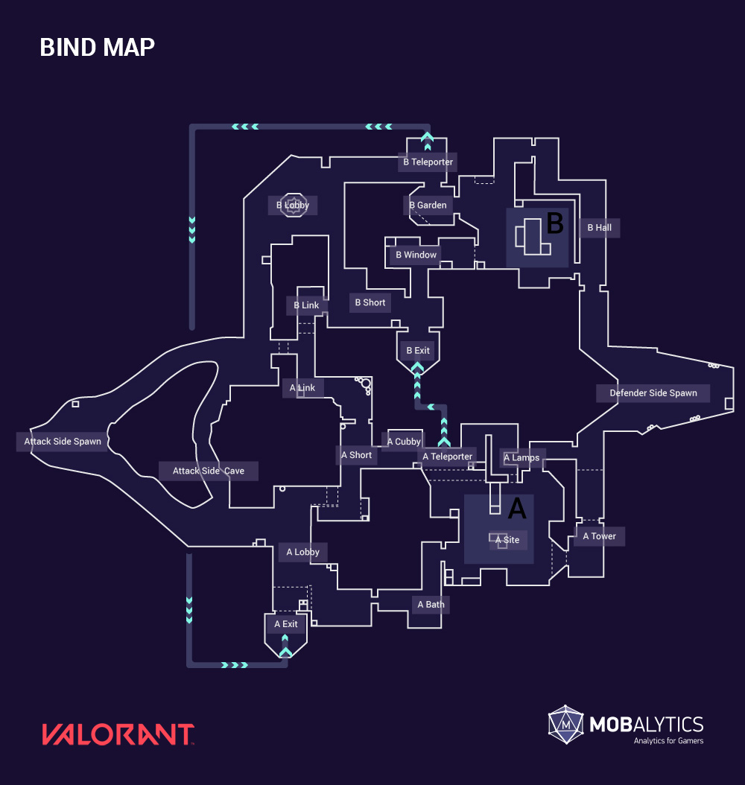
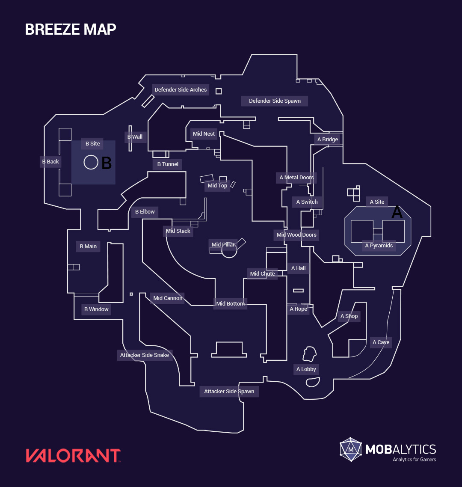
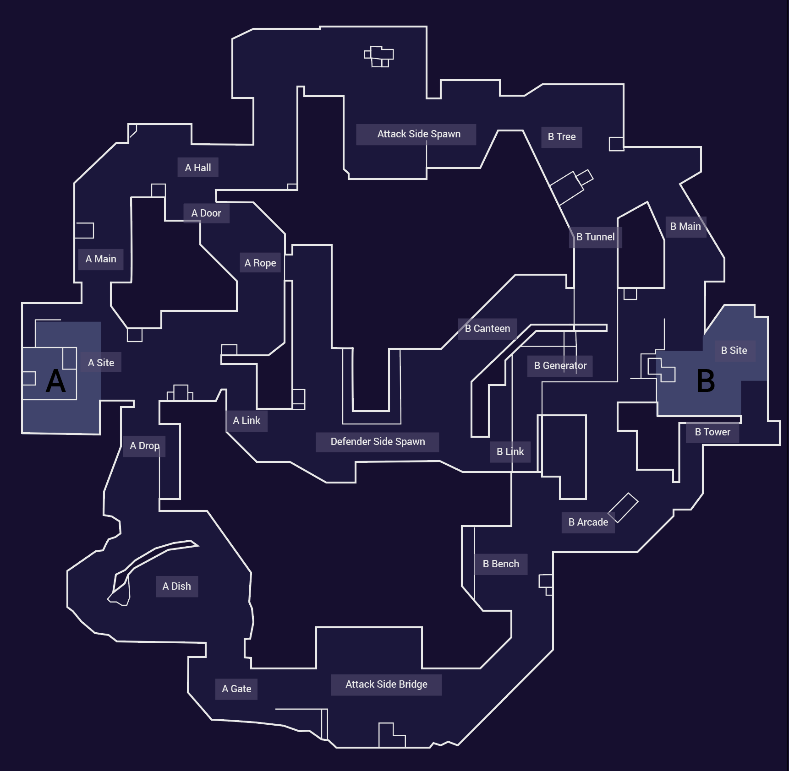
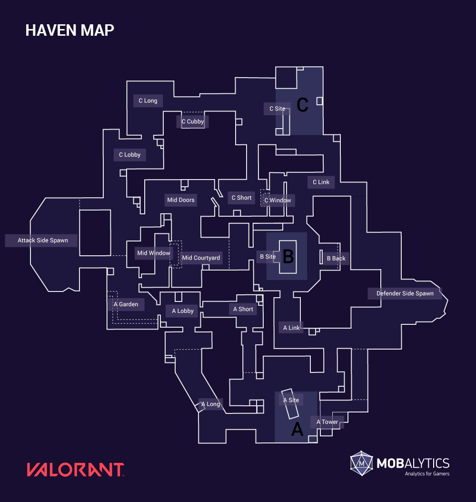
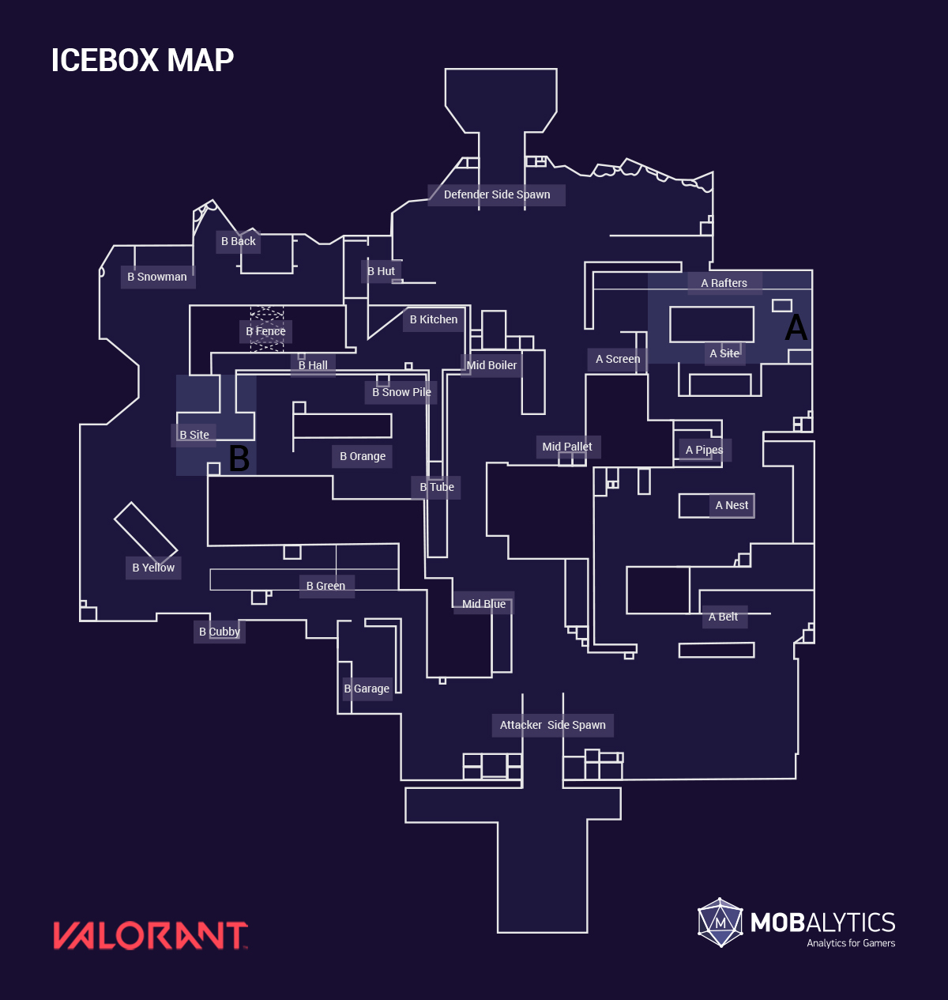
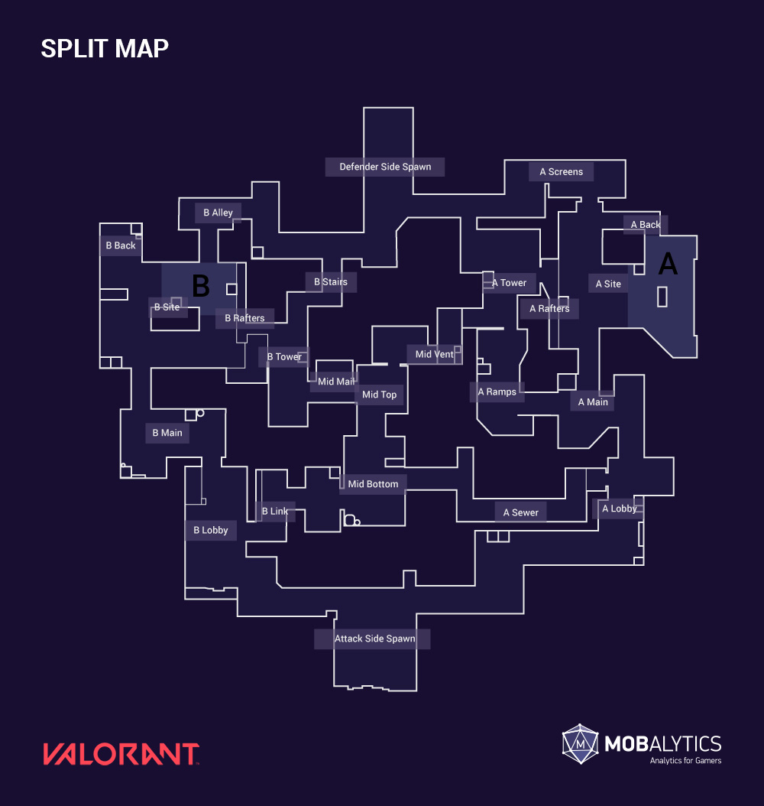

# Valorant Playbooks

## Playbooks

### Ascent

  
Layout

  

    
  

### Bind

  
Layout

  

    
  

### Breeze

  
Layout

  

    
  

### Fracture

  
Layout

  

    
  

### Haven

  
Layout

  

    
  

### Icebox

  
Layout

  

    
  

### Pearl

  
Layout

  

    
  

### Split
 

  
Layout

  

    
  

